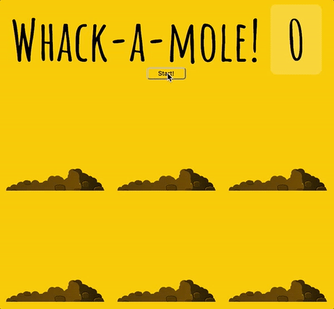

# Whack-a-mole Game

A 10-second-long game where the user tries to catch the mole.

Live version: https://whack-a-mole-game-js.herokuapp.com



## Tech stack
* Node
* Express
* Heroku
* Browsersync
* Vanilla JavaScript
* ES6
* Flexbox

## Getting started

```sh
git clone https://github.com/PiotrBerebecki/whack-a-mole-game.git
cd whack-a-mole-game
npm install

#1. Start the development server with Browsersync reloading
npm run dev

#2. Open this url in your browser: http://localhost:3000/public/index.html
```
